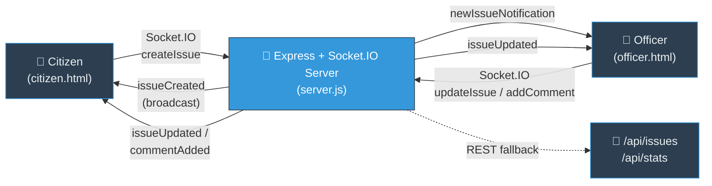
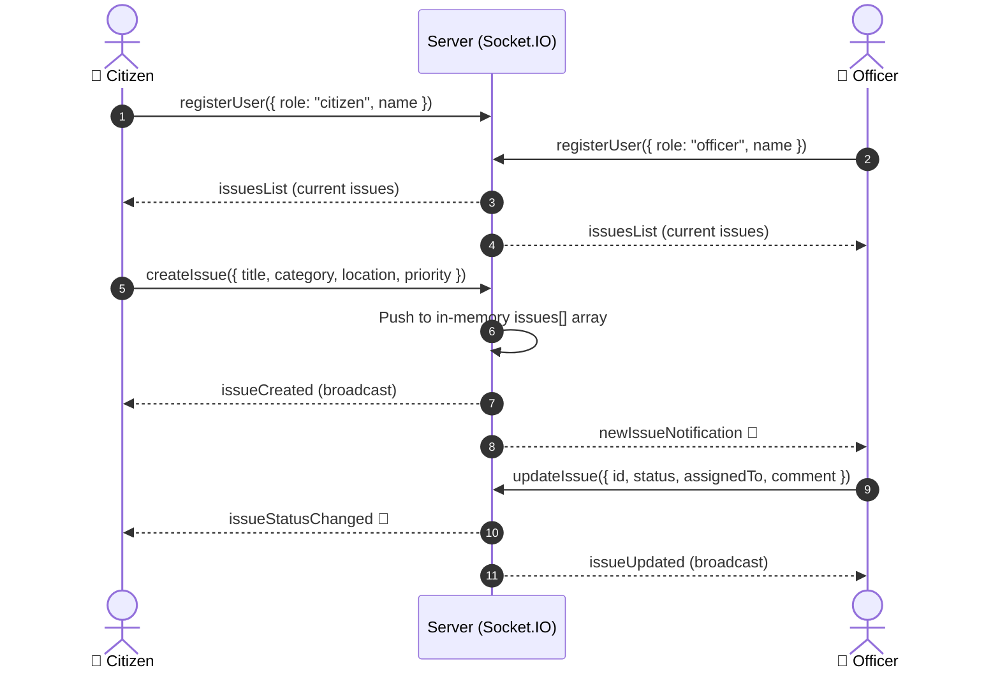

<div align="center">


<br/>

[](https://github.com/varunraj-2005/SMARTCITY-COMPLAINT-SYSTEM/stargazers)
[](https://github.com/varunraj-2005/SMARTCITY-COMPLAINT-SYSTEM/network/members)
[](#-license)

<br/>


</div>


## 📖 Table of Contents

<div align="center">

| [🏙️ Overview](#️-overview) | [✨ Features](#-features) | [🏗️ Architecture](#️-architecture) | [🔄 Real-Time Flow](#-real-time-issue-flow) |
|:---:|:---:|:---:|:---:|
| **[📋 Issue Data Model](#-issue-data-model)** | **[📡 REST API](#-rest-api-reference)** | **[🚀 Getting Started](#-getting-started)** | **[📁 Project Structure](#-project-structure)** |
| **[⚠️ Known Limitations](#️-known-limitations)** | **[🗺️ Roadmap](#️-roadmap)** | **[📜 License](#-license)** | **[📬 Contact](#-contact)** |

</div>


## 🏙️ Overview

**Smart City Complaint System** is a lightweight civic-tech web app that lets **citizens report local infrastructure problems** — potholes, broken streetlights, water issues, garbage pile-ups — and lets **officers track, prioritize, and resolve** them from a live dashboard.

The repo actually contains **two independent implementations** of the same idea, built at different stages of the project:

| Mode | Files | How it works |
|---|---|---|
| 🔴 **Real-Time Mode** (primary) | `server.js`, `citizen.html`, `officer.html`, `citizen-script.js`, `officer-script.js` | Full client-server app using **Express + Socket.IO**. Citizens and officers connect from separate devices/tabs and see updates **instantly**, no refresh needed. |
| 🟡 **Standalone Demo Mode** | `index.html`, `dashboard.html`, `admin.html`, `script.js` | A **browser-only** version with no backend — issues are saved to `localStorage`, useful for offline demos or quick UI testing. |

> 💡 If you're setting this up for the first time, use **Real-Time Mode** (`server.js` + `citizen.html` + `officer.html`) — that's the actively wired, multi-device version of the app.

<div align="center">


</div>

<br/>

## ✨ Features

<table>
<tr>
<td width="50%" valign="top">

### 👤 Citizen Portal (`citizen.html`)
- 📝 Submit issues with title, description, category & location
- 🚦 Set/see priority (Normal, High, Critical)
- 📡 Live status tracking — no manual refresh
- 🔔 Real-time toast notifications when an officer updates or comments on your issue
- 📂 "My Issues" view filtered to your own reports

</td>
<td width="50%" valign="top">

### 🚨 Officer Dashboard (`officer.html`)
- 📊 Live stats: total, submitted, in-progress, resolved
- 🗂️ Filter issues by status
- ✅ Update status, set priority, assign, and comment on any issue
- 🔔 Instant push notification the moment a citizen files a new complaint
- 👥 See who's currently connected (officers & citizens)

</td>
</tr>
</table>

### 🟡 Standalone Demo Mode (`admin.html` + `dashboard.html`)
- 🔐 Simple role-based login (`admin@city.com` → Admin, anything else → Citizen)
- 📍 Pick a location on a map when filing an issue
- ➕ Add custom complaint categories on the fly
- 💾 Auto-save drafts while typing (`enableAutoSave`)
- 🌙 Dark mode toggle
- 📱 Installable as a PWA via `service-worker.js` (offline caching + background sync scaffold)

<br/>

## 🏗️ Architecture



> ⚠️ Data lives in a plain in-memory array (`let issues = []`) inside `server.js` — it resets every time the server restarts. See [Known Limitations](#️-known-limitations).

<br/>

## 🔄 Real-Time Issue Flow



<br/>

## 📋 Issue Data Model

Every complaint is stored as an object shaped like this:

```json
{
  "id": "1735558812345",
  "title": "Large pothole on 5th Avenue",
  "description": "Pothole causing traffic slowdown near the school zone",
  "category": "pothole",
  "location": "5th Avenue & Main St",
  "reportedBy": "Alex",
  "status": "submitted",
  "priority": "normal",
  "assignedTo": null,
  "comments": [],
  "createdAt": "2026-08-27T10:20:12.345Z",
  "updatedAt": "2026-08-27T10:20:12.345Z"
}
```

| Field | Real-Time Mode (`citizen.html`) | Standalone Demo (`dashboard.html`) |
|---|---|---|
| **Category** | `pothole`, `streetlight`, `water`, `garbage`, `pollution`, `accident`, `other` | `Infrastructure`, `Electricity`, `Water Supply`, `Garbage`, `Traffic`, + custom |
| **Priority** | `normal`, `high`, `critical` | *(not present — priority is set by officer only)* |
| **Status** | `submitted` → `in_progress` → `resolved` → `closed` | `Submitted` → `In Review` → `In Progress` → `Resolved` → `Closed` |

> 📝 The two modes use **different category/status vocabularies** since they were built as separate iterations — worth unifying if you plan to merge them into one flow.

<br/>

## 📡 REST API Reference

The Socket.IO events above handle live updates, but the same server also exposes a small REST surface:

| Method | Endpoint | Description |
|---|---|---|
| `GET` | `/api/issues` | Returns all issues currently in memory |
| `POST` | `/api/issues` | Creates a new issue — body: `{ title, description, category, location, reportedBy }` |
| `PUT` | `/api/issues/:id` | Updates status, priority, assignment, or adds a comment |
| `GET` | `/api/stats` | Returns counts by status + number of connected officers/citizens |

**Example — creating an issue via REST:**
```bash
curl -X POST http://localhost:3000/api/issues \
  -H "Content-Type: application/json" \
  -d '{
    "title": "Broken streetlight",
    "description": "Light has been out for a week",
    "category": "streetlight",
    "location": "Park Road",
    "reportedBy": "Priya"
  }'
```

<br/>

## 🚀 Getting Started

New to Git? Just copy each command below, one at a time.

### ✅ Prerequisites

| Requirement | Version |
|---|---|
| Node.js | `v14+` recommended |
| npm | Comes bundled with Node.js |

### 1️⃣ Clone the repository

```bash
git clone https://github.com/varunraj-2005/SMARTCITY-COMPLAINT-SYSTEM.git
cd SMARTCITY-COMPLAINT-SYSTEM
```

### 2️⃣ Install dependencies

```bash
npm install
```

This installs the three runtime dependencies: `express`, `socket.io`, and `cors`.

### 3️⃣ Start the server

```bash
npm start
```

You should see:

```
🏙️  SMART CITY SERVER STARTED

✅ Server running on http://localhost:3000
✅ WebSocket connection ready

📊 API Endpoints:

   GET  /api/issues       - Get all issues
   POST /api/issues       - Create new issue
   PUT  /api/issues/:id   - Update issue
   GET  /api/stats        - Get statistics

🔗 Connect from:

   Officer Device : http://localhost:3000/officer.html
   Citizen Device : http://localhost:3000/citizen.html
```

### 4️⃣ Try it out with two tabs

- Open **`http://localhost:3000/citizen.html`** in one tab (or on your phone) → file a complaint.
- Open **`http://localhost:3000/officer.html`** in another tab → watch it appear instantly, then update its status and watch the citizen tab update live.

> ℹ️ There's no login form in Real-Time Mode — you'll be asked to type a display name via a browser prompt when the page loads.

<br/>

## 📁 Project Structure

```
SMARTCITY-COMPLAINT-SYSTEM/
│
├── server.js                # Express + Socket.IO backend (Real-Time Mode)
├── citizen.html             # Citizen portal UI
├── citizen-script.js        # Citizen-side Socket.IO client logic
├── officer.html             # Officer dashboard UI
├── officer-script.js        # Officer-side Socket.IO client logic
│
├── index.html                # Standalone Demo Mode: landing/login page
├── dashboard.html            # Standalone Demo Mode: citizen dashboard (localStorage)
├── admin.html                 # Standalone Demo Mode: admin panel (localStorage)
├── script.js                  # Shared logic for the standalone demo pages
├── script.js.backup           # Backup of an earlier script.js revision
│
├── landing.js / landing.css   # Styling & interactions for index.html
├── style.css                  # Shared styling
├── service-worker.js          # PWA offline caching + background sync
├── package.json / package-lock.json
└── README.md
```

> 📝 `index.html`'s page title currently reads *"GenAI AutoResQ - Smart Crash Communication System"* — a leftover from an earlier template. Worth updating so it matches the Smart City branding.

<br/>

## ⚠️ Known Limitations

Being upfront about the current state of the project:

- **No persistent database** — Real-Time Mode stores all issues in a plain JS array in server memory. Restarting the server wipes every complaint. Swapping in MongoDB, PostgreSQL, or even a JSON file would fix this.
- **No real authentication** — both citizen and officer identity are just a `prompt()` for a display name; anyone can claim any name or the officer role.
- **Two disconnected data models** — Real-Time Mode and Standalone Demo Mode use different category and status naming, and don't share any data.
- **Chart placeholders** — `officer.html` has `#statusChart` / `#priorityChart` containers, but there's no charting library wired in yet (no Chart.js/D3 in `package.json`).
- **Mismatched landing page branding** — see the `index.html` note above.

<br/>

## 🗺️ Roadmap

- [x] Real-time citizen ↔ officer sync via Socket.IO
- [x] REST API alongside WebSocket events
- [x] PWA scaffolding (service worker, offline cache)
- [ ] Persistent database (MongoDB/PostgreSQL) instead of in-memory storage
- [ ] Real authentication (JWT or session-based) for citizens & officers
- [ ] Unify category/status vocabulary across both modes
- [ ] Wire up real charts on the officer dashboard
- [ ] Photo upload support for issue reports

<br/>

## 📜 License

Licensed under the **ISC License**.

<br/>

## 📬 Contact

<div align="center">

**Varun Raj**

[](https://github.com/varunraj-2005)

<br/>

### ⭐ If this project helped you, consider giving it a star!


</div>
